# AMPConnect 2.0 — System Workflow Documentation

> **Project**: AMPConnect 2.0 — B2B Spare Parts Management Dashboard  
> **Version**: 2.1  
> **Date**: February 2026

---

## 1. System Overview

AMPConnect 2.0 is a **B2B web-based dashboard** for Astra Motor Part Centre (AMPC) Bima that connects administrators and customers through a unified platform for spare parts sales management, analytics, and loyalty rewards.

### Technology Stack

| Layer | Technology |
|-------|-----------|
| **Frontend** | React 18 + Vite |
| **Backend** | Node.js + Express |
| **Database** | PostgreSQL |
| **Authentication** | JWT + bcrypt |
| **Verification** | Email OTP |
| **Deployment** | Vercel (Frontend) + Render (Backend) |
| **Charts** | Chart.js + react-chartjs-2 |

---

## 2. System Architecture

---

## 3. User Roles

| Role | Access Point | Auth Method | Capabilities |
|------|-------------|-------------|-------------|
| **Admin** | `/admin/login` | Username + Password | Full system management, analytics, user control |
| **Customer** | `/customer/login` | Email + Password + OTP | View personal data, analytics, rewards, parts catalog |

---

## 4. Authentication & Security Workflow

### 4.1 Customer Registration Flow

```mermaid
flowchart TD
    A["🌐 Customer visits /customer/register"] --> B["📝 Fill Registration Form"]
    B --> C{"Validate Input"}
    C -->|"❌ Invalid"| D["Show Validation Errors"]
    D --> B
    C -->|"✅ Valid"| E["POST /api/auth/register"]
    E --> F{"Server Validation"}
    F -->|"Customer # not found"| G["❌ Error: Invalid Customer Number"]
    F -->|"Email exists"| H["❌ Error: Email Already Registered"]
    F -->|"✅ Pass"| I["Hash Password (bcrypt)"]
    I --> J["Save to Database"]
    J --> K["Generate OTP Code"]
    K --> L["📧 Send OTP via Email"]
    L --> M["Redirect to /customer/verify-otp"]
    M --> N["👤 Enter OTP Code"]
    N --> O{"Verify OTP"}
    O -->|"❌ Invalid/Expired"| P["Error: Try Again or Resend"]
    P --> N
    O -->|"✅ Valid"| Q["✅ Account Activated"]
    Q --> R["Redirect to /customer/login"]

    style A fill:#e0f2fe
    style Q fill:#d1fae5
    style G fill:#fee2e2
    style H fill:#fee2e2
```

**Registration Fields:**
- Nomor Customer (from admin)
- Nama Lengkap
- Email
- No. Telepon
- Password (min 8 chars, must contain: uppercase, lowercase, number, special character)
- Konfirmasi Password

**Password Strength Indicator:** Visual bar (Weak → Medium → Strong)

---

### 4.2 Customer Login Flow

```mermaid
flowchart TD
    A["🌐 Customer visits /customer/login"] --> B["📝 Enter Email & Password"]
    B --> C["POST /api/auth/login"]
    C --> D{"Rate Limit Check"}
    D -->|"❌ Exceeded (5/15min)"| E["⛔ Too Many Attempts"]
    D -->|"✅ Pass"| F{"Find User by Email"}
    F -->|"❌ Not Found"| G["❌ Login Failed"]
    F -->|"✅ Found"| H{"Account Verified?"}
    H -->|"❌ Not Verified"| I["Redirect to OTP Verification"]
    H -->|"✅ Verified"| J{"Compare Password (bcrypt)"}
    J -->|"❌ Mismatch"| K["❌ Wrong Password"]
    J -->|"✅ Match"| L["Generate JWT Token"]
    L --> M["Store Token & User Data"]
    M --> N["✅ Redirect to /customer/dashboard"]

    style A fill:#e0f2fe
    style N fill:#d1fae5
    style E fill:#fef3c7
    style G fill:#fee2e2
```

---

### 4.3 Admin Login Flow

```mermaid
flowchart TD
    A["🌐 Admin visits /admin/login"] --> B["📝 Enter Username & Password"]
    B --> C["POST /api/auth/admin/login"]
    C --> D{"Rate Limit Check"}
    D -->|"❌ Exceeded"| E["⛔ Too Many Attempts"]
    D -->|"✅ Pass"| F{"Find Admin by Username"}
    F -->|"❌ Not Found"| G["❌ Login Failed"]
    F -->|"✅ Found"| H{"Compare Password (bcrypt)"}
    H -->|"❌ Mismatch"| I["❌ Wrong Password"]
    H -->|"✅ Match"| J["Generate JWT Token (with role)"]
    J --> K["Store Token & Admin Data"]
    K --> L["✅ Redirect to /admin/dashboard"]

    style A fill:#ede9fe
    style L fill:#d1fae5
    style E fill:#fef3c7
```

---

### 4.4 Route Protection

```mermaid
flowchart LR
    A["User requests protected page"] --> B{"JWT Token exists?"}
    B -->|"No"| C["Redirect to Login"]
    B -->|"Yes"| D{"Check user role"}
    D -->|"Admin route + Admin role"| E["✅ Allow Access"]
    D -->|"Customer route + No role"| F["✅ Allow Access"]
    D -->|"Mismatch"| G["Redirect to correct login"]
```

---

### 4.5 Rate Limiting Policy

| Endpoint | Max Attempts | Window | Cooldown Message |
|----------|-------------|--------|-----------------|
| Login | 5 | 15 minutes | "Terlalu banyak percobaan login" |
| OTP Resend | 3 | 10 minutes | "Terlalu banyak permintaan OTP" |
| File Upload | 10 | 1 hour | "Terlalu banyak upload" |
| General API | 100 | 15 minutes | "Terlalu banyak permintaan" |

---

## 5. Admin Portal Workflow

### 5.1 Admin Navigation Structure

```mermaid
graph LR
    LOGIN["🔐 Admin Login"] --> DASH["📊 Dashboard"]
    DASH --> SALES["📈 Analitik Penjualan"]
    DASH --> STOCK["📦 Manajemen Stok"]
    DASH --> UPLOAD["⬆️ Upload Data"]
    DASH --> USERS["👥 Manajemen User"]
    DASH --> CUST_A["📉 Analitik Customer"]
    DASH --> INV_A["🏷️ Analitik Produk"]
    DASH --> PRICE_A["💲 Analitik Harga"]
    DASH --> REPORTS["📋 Laporan"]
    DASH --> SETTINGS["⚙️ Pengaturan"]
    DASH --> LOGOUT["🚪 Keluar"]
```

### 5.2 Admin Dashboard Features

```mermaid
flowchart TD
    AD["Admin Dashboard"] --> KPI["KPI Strip"]
    AD --> CHARTS["Charts Section"]
    AD --> RANKED["Ranked Products"]
    AD --> COMPARE["Monthly Comparison"]

    KPI --> K1["💰 Total Revenue"]
    KPI --> K2["🛒 Transactions"]
    KPI --> K3["📈 Gross Profit"]
    KPI --> K4["📊 Average GP%"]

    CHARTS --> C1["📉 Sales Trend Line Chart (30 Days)"]
    CHARTS --> C2["🍩 Revenue Composition Doughnut"]

    RANKED --> R1["Top 5 Products by Revenue"]
    COMPARE --> M1["Bar Chart: This Month vs Last Month"]
```

### 5.3 Data Upload Pipeline

```mermaid
flowchart TD
    A["Admin navigates to Upload Data"] --> B["Select Excel/CSV File"]
    B --> C{"File Type Valid?"}
    C -->|"❌ Invalid"| D["Show Error"]
    C -->|"✅ Valid"| E["POST /api/admin/upload"]
    E --> F{"Rate Limit Check (10/hr)"}
    F -->|"❌ Exceeded"| G["⛔ Upload Limit Reached"]
    F -->|"✅ Pass"| H["Parse & Validate Data"]
    H --> I{"Data Valid?"}
    I -->|"❌ Errors"| J["Return Validation Report"]
    I -->|"✅ Valid"| K["Bulk Insert to Database"]
    K --> L["Update Stock & Sales Records"]
    L --> M["✅ Upload Success"]

    style M fill:#d1fae5
    style D fill:#fee2e2
```

### 5.4 Admin Feature Summary

| Page | Key Features |
|------|-------------|
| **Dashboard** | KPI cards (Revenue, Transactions, Gross Profit, GP%), Sales Trend chart, Revenue Composition donut, Top Products ranking, Monthly Comparison bar chart |
| **Analitik Penjualan** | Transaction list with search/filter, date range picker, sales analytics with trend and bar charts, transaction detail modal |
| **Manajemen Stok** | Stock listing with search/filter by group, stock status indicators (Normal/Low/Critical), stock adjustment dialog, summary cards, CSV export |
| **Upload Data** | Excel/CSV file upload, data validation, bulk import to database |
| **Manajemen User** | Customer list, create/edit/disable accounts, role management |
| **Analitik Customer** | Customer spending patterns, segmentation analysis |
| **Analitik Produk** | Product performance, category analysis, margin scatter plots |
| **Analitik Harga** | Pricing trends, discount analysis, GP% by category |
| **Laporan** | Report generation, data export |
| **Pengaturan** | System configuration |

---

## 6. Customer Portal Workflow

### 6.1 Customer Navigation Structure

```mermaid
graph LR
    LOGIN["🔐 Customer Login"] --> DASH["🏠 Dashboard"]
    DASH --> HISTORY["🕐 Riwayat Pembelian"]
    DASH --> SPENDING["📊 Analisis Belanja"]
    DASH --> REWARDS["🎁 Reward Points"]
    DASH --> FAVORITES["❤️ Part Favorit"]
    DASH --> COMPARISON["📋 Laporan"]
    DASH --> PARTS["📦 Stok Part"]
    DASH --> PAYMENT["💳 Pembayaran"]
    DASH --> PROFILE["👤 Profil"]
    DASH --> LOGOUT["🚪 Keluar"]
```

### 6.2 Customer Dashboard Features

### 6.3 Customer Loyalty & Rewards Flow

### 6.4 Customer Feature Summary

| Page | Key Features |
|------|-------------|
| **Dashboard** | Welcome banner with name & tier progress, stats cards (Total Spend, Transactions, Points, Favorite Part), quick action grid, recent transactions table |
| **Riwayat Pembelian** | Full purchase history, invoice details, date filtering, downloadable invoices |
| **Analisis Belanja** | Spending analytics with charts, trend analysis, category breakdown |
| **Reward Points** | Points balance, tier status & progress, redemption history |
| **Part Favorit** | Favorite/frequently purchased parts, stock monitoring |
| **Laporan & Perbandingan** | Period comparison reports, annual performance summaries |
| **Stok Part** | Parts catalog with search, real-time stock availability |
| **Pembayaran** | Payment information and history |
| **Profil** | Personal information, password change, account settings |

---

## 7. Complete System Flowchart

```mermaid
flowchart TD
    START["🌐 User visits AMPConnect"] --> ROLE{"Select Portal"}

    ROLE -->|"Customer"| CL["Customer Login Page"]
    ROLE -->|"Admin"| AL["Admin Login Page"]

    %% Customer Flow
    CL --> NEW{"Have Account?"}
    NEW -->|"No"| REG["Register with Customer Number"]
    REG --> OTP["Verify Email via OTP"]
    OTP --> CL
    NEW -->|"Yes"| CAUTH["Authenticate (Email + Password)"]
    CAUTH --> CJWT["Receive JWT Token"]
    CJWT --> CDASH["Customer Dashboard"]

    CDASH --> CF1["View Purchase History"]
    CDASH --> CF2["Analyze Spending Patterns"]
    CDASH --> CF3["Check Reward Points & Tier"]
    CDASH --> CF4["Monitor Favorite Parts Stock"]
    CDASH --> CF5["Generate Comparison Reports"]
    CDASH --> CF6["Browse Parts Catalog"]
    CDASH --> CF7["View Payment Info"]
    CDASH --> CF8["Manage Profile"]

    %% Admin Flow
    AL --> AAUTH["Authenticate (Username + Password)"]
    AAUTH --> AJWT["Receive JWT Token (with Role)"]
    AJWT --> ADASH["Admin Dashboard"]

    ADASH --> AF1["View Sales Analytics"]
    ADASH --> AF2["Manage Stock Inventory"]
    ADASH --> AF3["Upload Sales/Stock Data"]
    ADASH --> AF4["Manage Customer Accounts"]
    ADASH --> AF5["View Customer Analytics"]
    ADASH --> AF6["View Product Analytics"]
    ADASH --> AF7["View Pricing Analytics"]
    ADASH --> AF8["Generate Reports"]
    ADASH --> AF9["System Settings"]

    %% Data Flow
    AF3 -->|"Excel/CSV Upload"| DB["📁 PostgreSQL Database"]
    DB -->|"Aggregated Data"| ADASH
    DB -->|"Customer-specific Data"| CDASH

    style START fill:#e0f2fe
    style CDASH fill:#d1fae5
    style ADASH fill:#ede9fe
    style DB fill:#fef3c7
```

---

## 8. API Endpoint Map

### Auth Routes (`/api/auth`)
| Method | Endpoint | Description |
|--------|----------|-------------|
| POST | `/register` | Customer registration |
| POST | `/login` | Customer login |
| POST | `/admin/login` | Admin login |
| POST | `/verify-otp` | Verify OTP code |
| POST | `/resend-otp` | Resend OTP email |

### Admin Routes (`/api/admin`)
| Method | Endpoint | Description |
|--------|----------|-------------|
| GET | `/dashboard` | Dashboard KPIs & charts data |
| GET | `/sales` | Sales transactions |
| GET | `/sales/analytics` | Sales analytics data |
| GET | `/stock` | Stock inventory |
| POST | `/stock/adjust` | Adjust stock quantities |
| POST | `/upload` | Upload Excel/CSV data |
| GET/POST | `/users` | User management |

### Customer Routes (`/api/customer`)
| Method | Endpoint | Description |
|--------|----------|-------------|
| GET | `/dashboard` | Personal dashboard data |
| GET | `/history` | Purchase history |
| GET | `/spending` | Spending analytics |
| GET | `/rewards` | Reward points & tier |
| GET | `/favorites` | Favorite parts |

### Parts Routes (`/api/parts`)
| Method | Endpoint | Description |
|--------|----------|-------------|
| GET | `/` | Parts catalog with search |
| GET | `/groups` | Product group listing |

---

## 9. Security Architecture Summary

| Security Layer | Implementation |
|---------------|---------------|
| **Password Hashing** | bcrypt with salt rounds |
| **Token Auth** | JWT with expiration |
| **Rate Limiting** | express-rate-limit (per endpoint) |
| **CORS** | Whitelist-based origin check |
| **Input Validation** | Server-side & client-side |
| **OTP Verification** | Email-based, time-limited codes |
| **Route Guards** | React route protection (role-based) |

---

*Document generated for AMPConnect 2.0 presentation purposes.*
